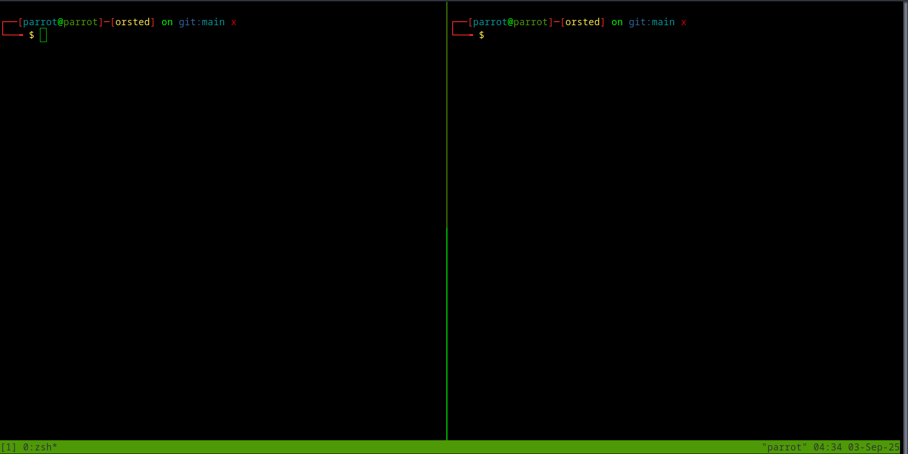

# Orsted C2

> **“They live as they please with that tiny pride of theirs and die because of a foolish enemy.”**  

Orsted C2 is a **C2 framework** created for educational purposes.

It consists of multiple **Orsted beacons** that communicate with each other and the main **Orsted server**. An operator can interact with the beacons using the **Orsted client**.

---

## Documentation

For full details and setup instructions, check the **Orsted documentation**:

🌐 [Visit the Orsted Docs](https://almounah.github.io/orsted-doc/)

---

## 🔗 Quick Links

- **Orsted C2 code**: [GitHub Repository](https://github.com/almounah/orsted)  
- **Documentation source code**: [GitHub Docs](https://github.com/almounah/orsted-doc)  
- **Documentation site**: [Orsted Docs Site](https://almounah.github.io/orsted-doc/)  
- **Example usage**: [Orsted in Action](https://almounah.github.io/orsted-doc/intro/4-example-usage/)

